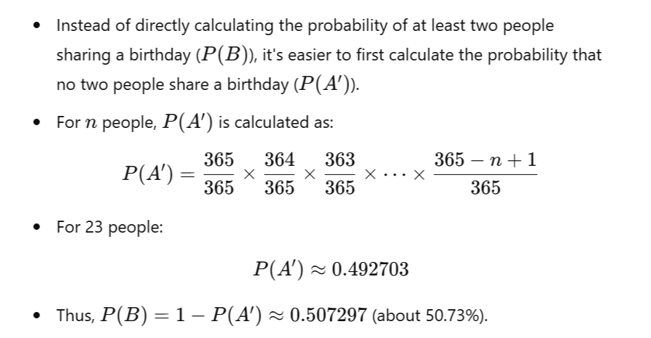

## Birthdays Problem

### The Birthday Problem and Calculating the Probability

The famous birthday problem is a classic exercise in probability theory. It's an interesting problem for sure, but typically it is calculating the wrong thing. 

 It asks for the probability that in a group of 𝑛 randomly chosen people, at least two of them share the same birthday. The surprising result, known as the birthday paradox, is that only 23 people are needed for there to be a greater than 50% chance that at least two people share a birthday.

#### Key Concepts of the Birthday Problem:
1. The Setup:
* Assume there are 365 days in a year (ignoring leap years).
* Each person is equally likely to be born on any of these 365 days.
* Birthdays are independent of each other.

2. The Paradox:
* Intuitively, it seems that the number of people needed for a 50% chance of a shared birthday should be much larger.
* However, with just 23 people, the probability exceeds 50%.

3. Calculating the Probability:

#### Why It Might Be Calculating the Wrong Thing:
1. Real-World Assumptions:
* The problem assumes a uniform distribution of birthdays, which is not true in reality. Birthdays are not evenly distributed throughout the year.
* The problem ignores leap years, twins, and other real-world factors that affect birthday distribution.
2. Different Interpretations:
* The birthday problem calculates the probability of at least one shared birthday. In some contexts, what might be more interesting is the probability of multiple pairs sharing a birthday or the distribution of birthdays in larger groups.
3. Practical Applications:
* In real-world applications such as cryptographic attacks (birthday attacks), the assumptions and conditions are different. The uniformity and independence of "birthdays" (hash values, in this context) might not hold, and the problem might need to be adjusted accordingly.

#### Exploring Further:
1. Alternative Scenarios:

* Investigate how the probability changes with different distributions of birthdays (e.g., more births in certain months).
* Consider scenarios with additional constraints, such as specific groups of people (e.g., all born in the same decade).
2. Extensions and Variations:
* Explore the "generalized birthday problem," which looks at other types of coincidences or shared characteristics in groups.
* Study variations involving different "year" lengths or cultural practices (e.g., non-Gregorian calendars).
3. Educational Value:
* The birthday problem is valuable for teaching concepts like probability, combinatorics, and the importance of assumptions in modeling real-world phenomena.
* It can be used to illustrate the difference between theoretical and applied probability.

####   Conclusion:
While the classic birthday problem provides an intriguing and counterintuitive result, it's essential to recognize its assumptions and limitations. By exploring variations and considering real-world factors, we can gain a deeper understanding of probability and its applications.