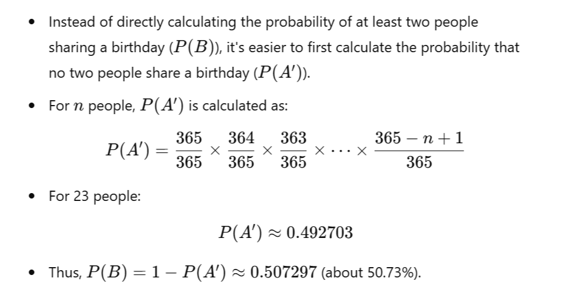

### The Birthday Problem and Calculating the Probability

The famous birthday problem is a classic exercise in probability theory. It's an interesting problem for sure, but typically it is calculating the wrong thing. 

 It asks for the probability that in a group of 𝑛 randomly chosen people, at least two of them share the same birthday. The surprising result, known as the birthday paradox, is that only 23 people are needed for there to be a greater than 50% chance that at least two people share a birthday.

#### Key Concepts of the Birthday Problem:
1. The Setup:
* Assume there are 365 days in a year (ignoring leap years).
* Each person is equally likely to be born on any of these 365 days.
* Birthdays are independent of each other.

2. The Paradox:
* Intuitively, it seems that the number of people needed for a 50% chance of a shared birthday should be much larger.
* However, with just 23 people, the probability exceeds 50%.

3. Calculating the Probability:

